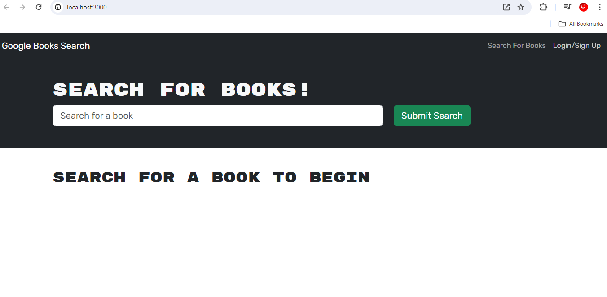
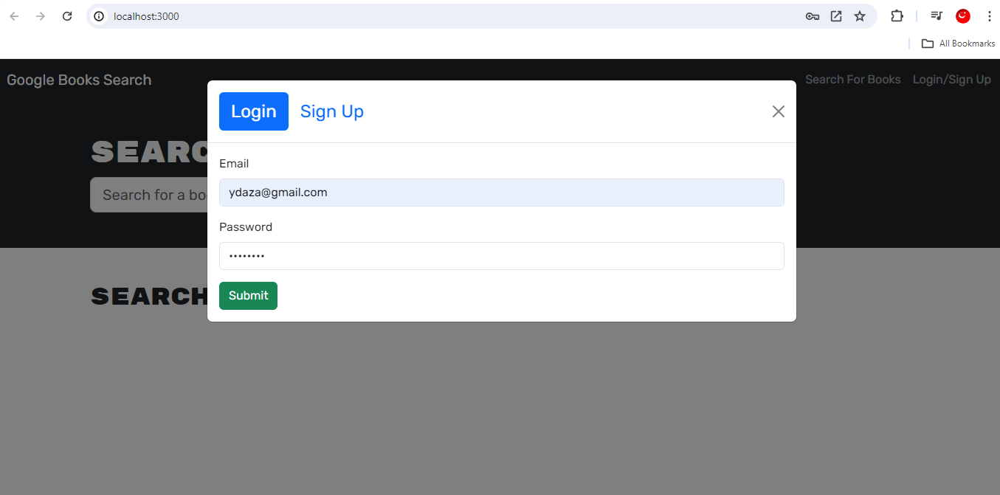
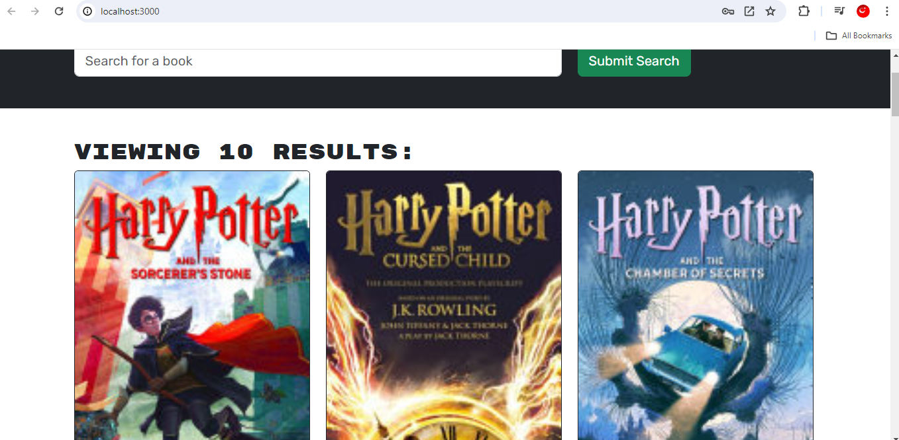

# MERN-Book-Search-Engine

## Description

### What was your motivation?
- My motivation was to create a user-friendly and efficient book search engine that integrates seamlessly with Google Books API, providing users with a convenient platform to search for books, save their favorites, and manage their reading lists.

### Why did you build this project? 
- I built this project to address the need for a centralized platform where users can easily search for books, save their favorites, and access them from anywhere, solving the problem of scattered book lists and making the reading experience more organized.

### What problem does it solve?
- This project solves the problem of organizing and accessing saved books in one place, making it easier for users to keep track of their reading interests and recommendations. It also streamlines the book search process by integrating with Google Books API.

### What did you learn?
- Through this project, I learned about integrating APIs, implementing user authentication and authorization, managing user sessions, designing user interfaces with modal pop-ups for login/signup, handling user input validation, creating interactive buttons for book management, and implementing responsive design for a seamless user experience.

## Installation

1. Install `node.js` and `npm` on your terminal command.
2. Navigate to the cloned repository directory.
3. Type `npm install` to install all dependencies listed in the packege.json file.
4. Create a new database(MongoDB).
5. Type `npm start` and the server will be running at `http://localhost3000`.

## Usage

1. Open a web browser and navigate to the URL where the book search engine is hosted.
2. Type a search term(e.g, book title, author, keyword) in the input field.
3. Click the "Login/Signup" menu option. If you have an account, select "Login", enter your email address and password. If you don't have an account, select "Signup", enter username, email and password.

## Screenshot

    

## Features

<a href="https://www.mongodb.com/">MongoDB</a>

<a href="https://render.com/">Render</a>

## MIT License

Copyright (c) 2024 Joseph Daza

Permission is hereby granted, free of charge, to any person obtaining a copy
of this software and associated documentation files (the "Software"), to deal
in the Software without restriction, including without limitation the rights
to use, copy, modify, merge, publish, distribute, sublicense, and/or sell
copies of the Software, and to permit persons to whom the Software is
furnished to do so, subject to the following conditions:

The above copyright notice and this permission notice shall be included in all
copies or substantial portions of the Software.

THE SOFTWARE IS PROVIDED "AS IS", WITHOUT WARRANTY OF ANY KIND, EXPRESS OR
IMPLIED, INCLUDING BUT NOT LIMITED TO THE WARRANTIES OF MERCHANTABILITY,
FITNESS FOR A PARTICULAR PURPOSE AND NONINFRINGEMENT. IN NO EVENT SHALL THE
AUTHORS OR COPYRIGHT HOLDERS BE LIABLE FOR ANY CLAIM, DAMAGES OR OTHER
LIABILITY, WHETHER IN AN ACTION OF CONTRACT, TORT OR OTHERWISE, ARISING FROM,
OUT OF OR IN CONNECTION WITH THE SOFTWARE OR THE USE OR OTHER DEALINGS IN THE
SOFTWARE.

